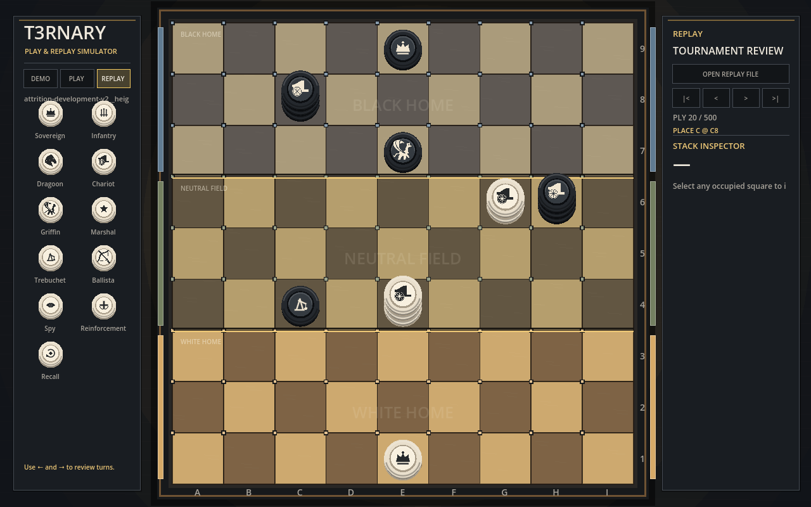

# T3RNARY Simulator

The Godot application opens in Play mode and provides two focused modes: local
play and turn-by-turn replay review. Both use the same GDScript rules engine
and shared JSON piece catalog as the automated tests.

## Play

Choose **PLAY** to begin a new game.

1. White selects any square on rank 1 for the White Sovereign.
2. Black selects any square on rank 9 for the Black Sovereign.
3. The opening begins with White's first PLACE.

Use **OPPONENT: HUMAN / COMPUTER** to switch between hot-seat play and the
initial Standard computer opponent. The computer currently plays Black. It
uses deterministic selective search with explicit priorities for immediate
victory, Sovereign safety, exchanges, height-3 threats, and useful Infantry
development. The implementation is intentionally compact enough for rapid
rules testing; it is a baseline opponent, not a claim of solved play.
Its tactical evaluation prices every piece in an exposed stack, compares all
available Sovereign defenses by their resulting position, and extends forcing
lines only while a Sovereign threat remains unresolved. Infantry remains the
default development material; the opponent does not hoard it for hypothetical
future defense.
In Computer mode, selecting White's Sovereign immediately prompts the computer
to place Black's Sovereign in a rotationally mirrored back-rank position.
Computer search runs away from the drawing and input loop, so the simulator
remains responsive while the status panel reports **COMPUTER THINKING**.

Select a friendly stack to display its legal MOVE/ATTACK destinations. Select
a reserve piece in the left panel to display its legal PLACE destinations.
The left rail presents the active player's reserve as physical piles. Each
pile shows its current count and visibly loses layers as pieces are played.
Infantry is divided into piles of five and four; the four-piece pile is spent
first, followed by the five-piece pile. A spent pile remains visible as a
gray empty token outline so the inventory layout does not move or disappear.

Placing a Ballista or Trebuchet may create legal SHOOT targets. After choosing
the placement square, select a red target to SHOOT or choose **PLACE WITHOUT
SHOOTING**. Recall first asks which discarded piece will return, then displays
that piece's legal destinations.

Choose **UNDO** or press Backspace to restore the preceding state. Choose
**REDO**, press Shift+Backspace, or use the standard Ctrl/Cmd+Shift+Z shortcut
to move forward again. Making a different action after Undo clears the redo
path. Escape clears the current selection.

Every game is automatically recorded after Sovereign setup and after
each action, Undo, or Redo. The version 2 JSON contains the initial state,
current action history, ruleset, outcome, and completion status, so the same
file can be opened in Replay mode or used by later analysis tools. Development
runs save under `research/replays/human`; packaged builds fall back to the
application's `user://human_games` data folder.

Computer games also record an annotation for every AI action: its concise
decision reason, evaluation score, search depth, and number of candidates
considered. This makes questionable play reproducible and gives policy work a
concrete audit trail.

New games use the current beta ruleset: four opening PLACE actions per player,
the shared neutral-territory height-3 gate, MOVE and artillery attrition, Royal
Attack, and back-rank Conquer victory.

## Replay

Choose **REPLAY**, then open a version 2 tournament replay JSON file. The file
dialog starts in `research/replays` when that local folder is available.

Use the four controls to jump to the initial position, move backward one ply,
move forward one ply, or jump to the final recorded position. The Left and
Right Arrow keys also step backward and forward. The panel reports the current
ply and recorded action, and any occupied square can be inspected.

Replay states are reconstructed by applying each recorded action through the
Godot rules engine. If a retired replay contains an action that is no longer
legal under the current engine, review remains available through the last
compatible ply and the simulator reports where reconstruction stopped.

The right sidebar combines a compact stack inspector with a live notation feed.
Drag the divider to resize either pane, or use each pane's header control to
collapse it. **COPY** places a complete notation record through the current
position on the clipboard. In Replay mode, later actions are deliberately
excluded so the copied record always matches the board being reviewed.

