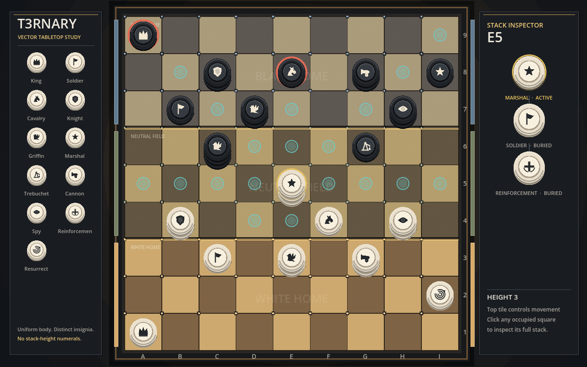

# Visual Direction

T3RNARY's simulator uses a polished vector tabletop presentation from its
first playable version. The visual system is presentation-only; it consumes
game state and legal actions without owning rules.

## Core principles

- Tokens are uniform round checkers. Player ownership controls their material
  color; piece identity is expressed only through a consistent insignia family.
- Stack height is shown physically through visible token bodies, never through
  a numeric badge placed on a flat counter.
- The TOP piece remains immediately readable because it identifies the entire
  stack. Selecting a stack opens an exploded inspector showing every buried
  tile in order.
- The checker pattern remains intact across all nine ranks. Warm, neutral, and
  cool material casts, constructed boundary rails, and territory labels make
  the three regions identifiable without relying on one color cue.
- Artwork is drawn from Godot vector primitives and remains resolution
  independent. No gameplay code depends on presentation resources.

## Player materials

- White: warm ivory body, pale inset face, graphite insignia.
- Black: charcoal body, raised dark edge, ivory insignia.

All eleven pieces share the same body geometry. This ensures that a converted
Spy Stack changes ownership coherently without acquiring a special token form.

## Stacks

Each level of a stack is displaced vertically and retains its own shaded wall,
rim, and contact shadow. The top token carries the TOP piece's insignia and
shows the stack's identity. Selection uses a restrained brass halo rather than
a height numeral.

The inspector presents the stack from TOP to bottom with explicit TOP and
Buried roles. This preserves the physical board metaphor while making hidden
composition faster to inspect than it would be on a real tabletop.

## Territory

Black home, the neutral field, and White home each span three ranks. Their
materials are differentiated using multiple signals:

- a quiet color cast blended into both checker colors;
- a matching side rail;
- engraved brass double rules at the territory boundaries;
- embedded territory labels and distinct square-corner inlays.

The intent is for territory to feel manufactured into the board rather than
painted over it by an analysis interface.

## Prototype boundary

The current scene demonstrates the vector construction, full icon family,
territories, physical stacks, selection, hover lift, rules-generated
move/capture markers, and stack inspection. It uses a deliberately composed
sample position. Binding the complete position and PLACE interactions to live
hot-seat play is the next presentation milestone.

The visual prototype immediately exposed an incorrect Griffin progression in
the original simulation rules. Griffin 1 and Griffin 2 Stacks use traditional
1x2/2x1 leaps; a Griffin 3 Stack instead uses 2x3/3x2 leaps.
